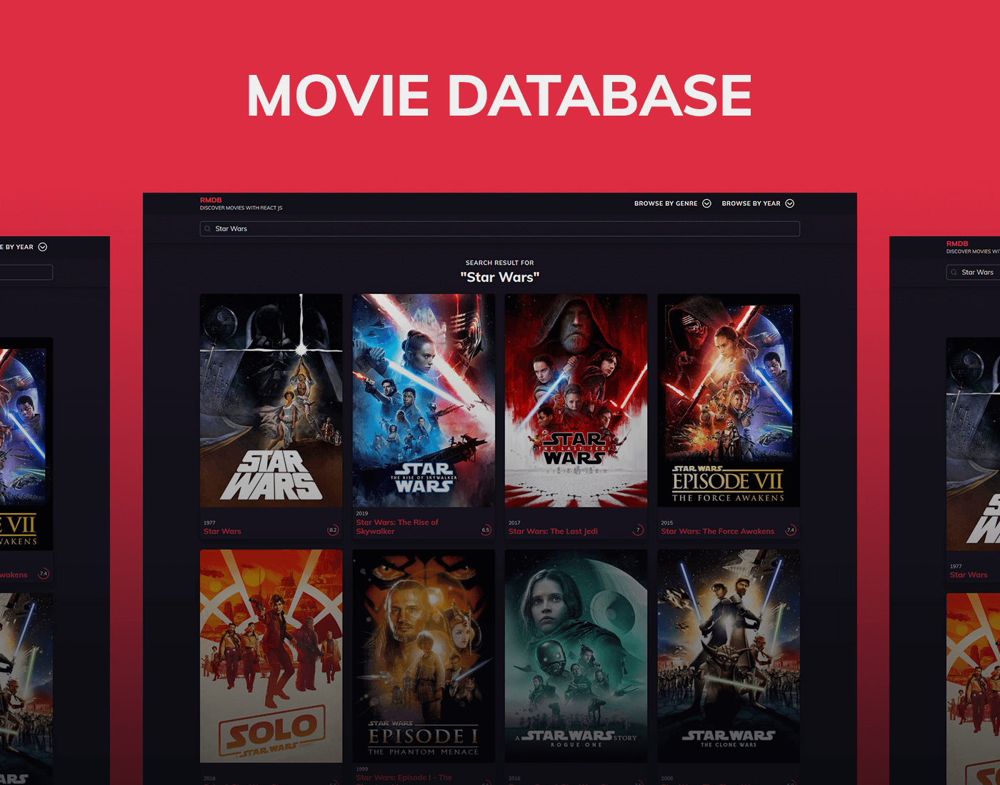

# React Movie Database
A React application for discovering movies from [TMBD](https://www.themoviedb.org/) database.

See the working example at https://iftee.github.io/react-movie-database/

## Features
- Discover the currently popular movies.
- Search movies using movie name in homepage.
- View movie storyline, trailer, cast, information etc. from movie pages.
- Browse movies based on cast, director and writer.
- Discover movies based on genre and release year.

## Developer Instruction
After a fresh `git clone`, to install all node dependencies, use
```shell
npm install
```
If you do not have any key for TMDB API, get an API key and update the `API_Key` value in `src/config.js` file.

To start the development server, use
```shell
npm run start
```
To create a production build, use
```shell
npm run build
```
To deploy at `github-pages` environmet, use
```shell
npm run deploy
```

## Future Plans
When I have free time:
- [ ] Adding feature to pull review data
- [ ] Adding feature to pull similar movies data

## Tools Used
- [Create React App](https://create-react-app.dev/) to bootstrap the application
- [The Movie Database API v3](https://developers.themoviedb.org/3/getting-started/introduction) to fetch data from
- [Bulma](https://bulma.io/) through [React Bulma Components](https://www.npmjs.com/package/react-bulma-components) to make resonsive layout
- [React Routers](https://github.com/ReactTraining/react-router) to make the application routes
- [React Icons](https://react-icons.netlify.com/#/) for rendering icons
